# Hướng dẫn tạo môi trường lập trình cho các dòng vi điều kiển

> Tiêu biểu sẽ là ESP32 và RASPBERRY PICO

## Môi trường Micropython

- Lập trình được ESP8266, ESP32 và RASPBERRY PICO

Bước 1: Di tới trang của hãng Micropython để tải firmware theo chip sử dụng

[Đường dẫn tới Micropython](https://micropython.org/download/)

Bước 2: Tải firmware cho vi điều khiển cần sử dụng


> Trong ví dụ chọn ESP32 dòng ESP32C3


> Firmware là các file .bin hoặc đuôi khác như .app-bin,...


> Click chọn file mong muốn và tải về máy lưu trữ ở thư mục dễ nhớ dễn tiếp cận

Bước 3: Sử dụng môi trường python 

> Check xem máy tính cá nhân có môi trường python chưa


> Nếu như trong hình là đã có nếu không thì ấn vào đây cài python cho máy tính bạn

[Đường dẫn tới python](https://www.python.org/downloads/)


> Nhớ tích Add python.exe to PATH

> Sau khi có python thì mở terminal

> Tạo môi trường ảo

```bash
python -m venv venv
```


> Kích hoạt môi trường ảo python

```bash
venv\Script\activate
```


- Thư viện để flash vi điều khiển

```bash
pip install esptool
```

- Thư viện để đẩy file python qua vi điều khiển

```bash
pip install adafruit-ampy
```

- Ví dụ:

```bash
ampy -p COMx put main.py
```

- Thư viện để remote vào vi điều khiển

```bash
pip install mpfshell
```

- Ví dụ 

```bash
mpfshell COMx
```

> Chú ý: hiện tại khi cài và chạy mpfshell sẽ bị lỗi


- Cách khắc phục 

```bash
pip install telnetlib3
```


Vào `..\Lib\site-packages\mp\contelnet.py` để sửa 


Nhớ lưu


Như vậy là thành công

## Thiết lập SDK C/C++ cho Raspberry Pico

> Chỉ dùng môi trường này cho raspberry pico

- Cài Cmake [...](https://cmake.org/download/)

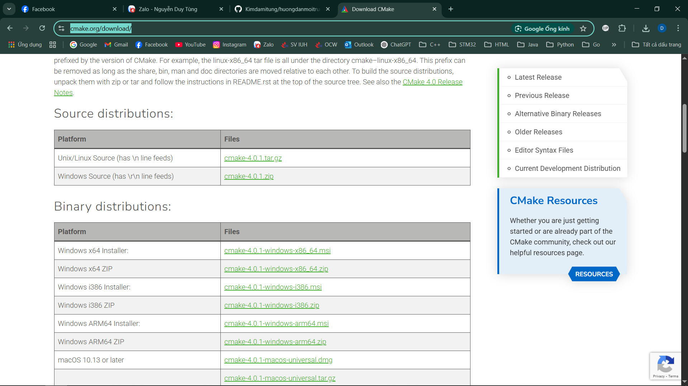

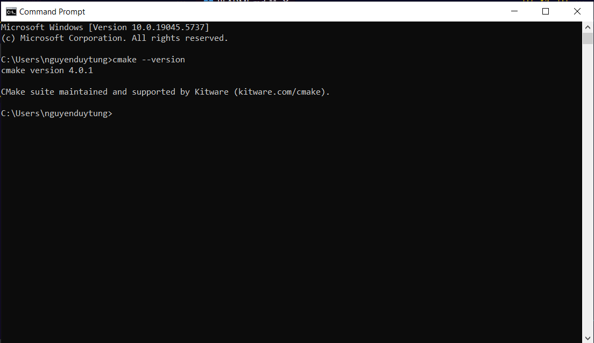

- Cài GNU Make [...](https://sourceforge.net/projects/gnuwin32/files/make/3.81/make-3.81.exe/download?use_mirror=onboardcloud&download=)


> Sau khi cài GNU Make thì chưa được PATH môi trường ta nên tự dẫn làm thủ công

Thường đường dẫn sau khi xài mà ko thay đổi gì sẽ là : C:\Program Files (x86)\GnuWin32\bin

Copy đường dẫn đó, ấn phím Window chọn "var" và chọn theo hình

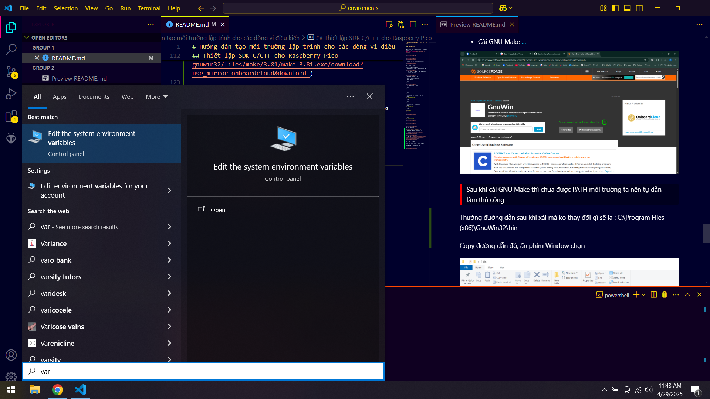

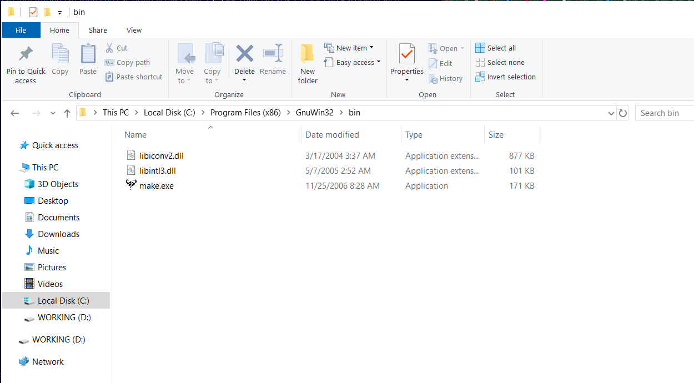

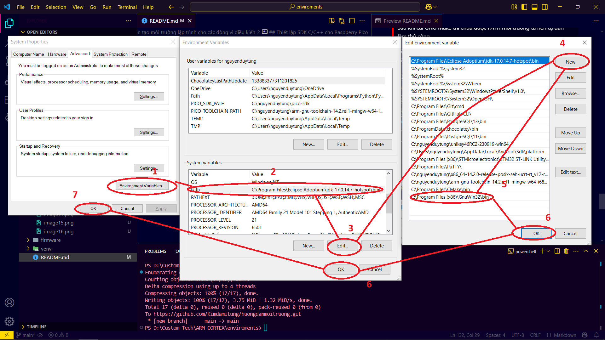

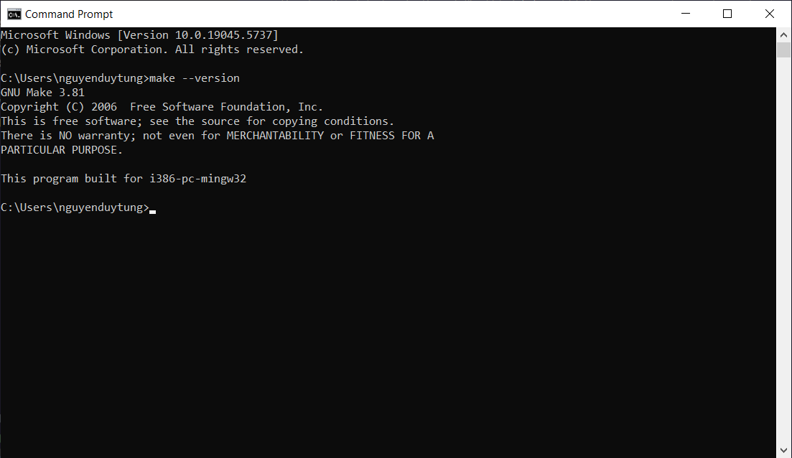

- Cài biên dịch C/C++ [...](https://github.com/niXman/mingw-builds-binaries/releases)

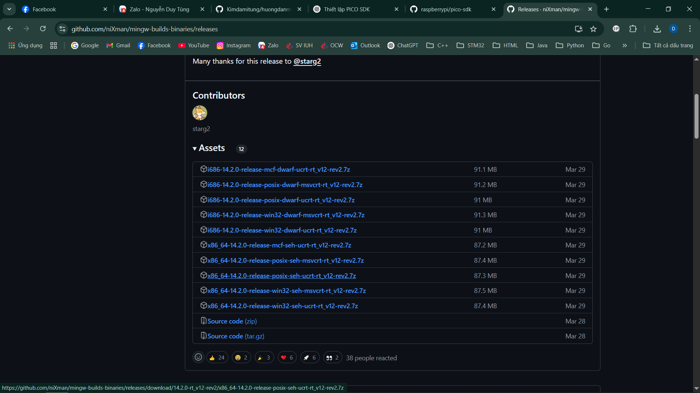

- Cài ARM GNU toolchain [...](https://developer.arm.com/downloads/-/arm-gnu-toolchain-downloads)

> Nên chọn x86_64-14.2.0-release-posix-seh-ucrt-rt_v12-rev2.7z để tải về

> PATH đường dẫn tới bin 

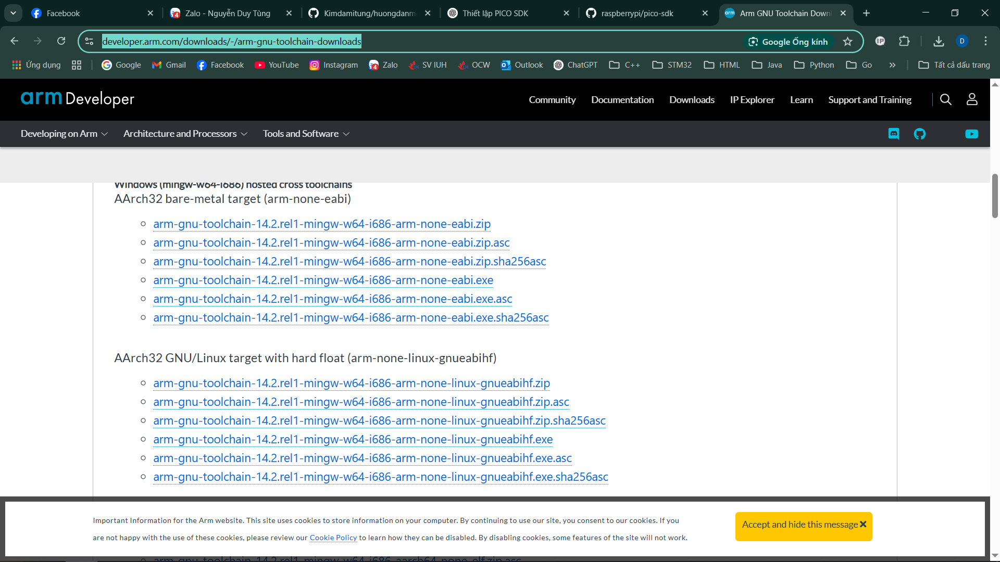

Nên chọn file .zip r giải nén nó ra 

> PATH đường dẫn tới bin với tên biến là PICO_TOOLCHAIN_PATH

- Cài GitBash [...](https://git-scm.com/downloads)

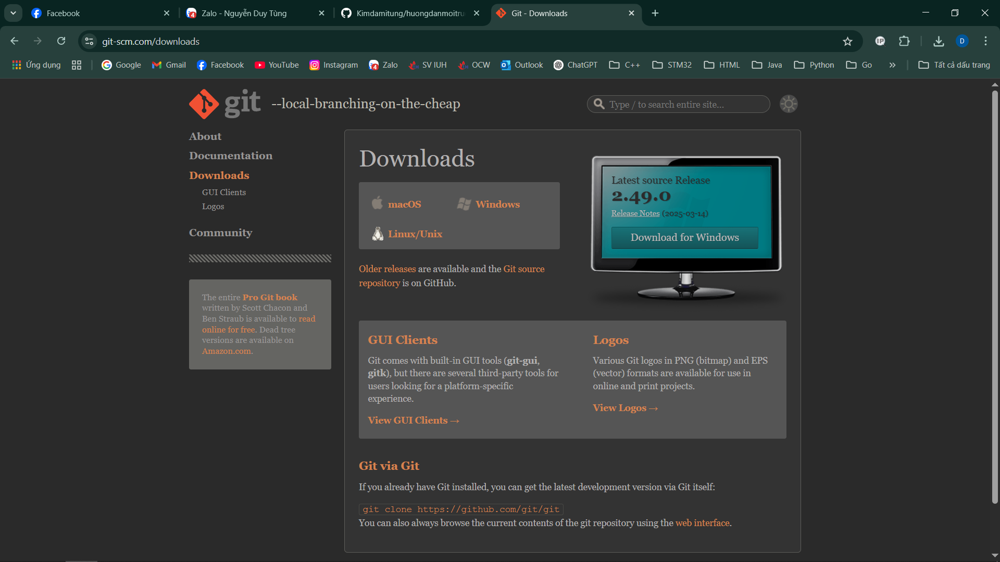

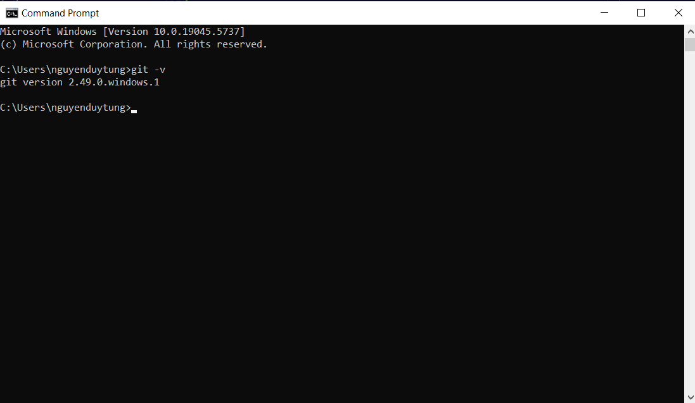

- Git clone  pico sdk về máy

> Dùng terminal để làm nhé, nhớ tạo 1 folder nào nó mà lưu trữ

```bash
git clone https://github.com/raspberrypi/pico-sdk.git
```

> Cập nhật submodules

```bash
cd pico-sdk && git submodule update --init --recursive
```

> Sau khi cài thành công thì tiếp tục chạy môi trường thiết lập

```bash
mkdir build && cd build
```

```bash
cmake -G "MinGW Makefiles"
```

```bash
mingw32-make
```

> PATH đường dẫn pico-sdk vào với tên C:\nguyenduytung\pico-sdk

- Kết quả

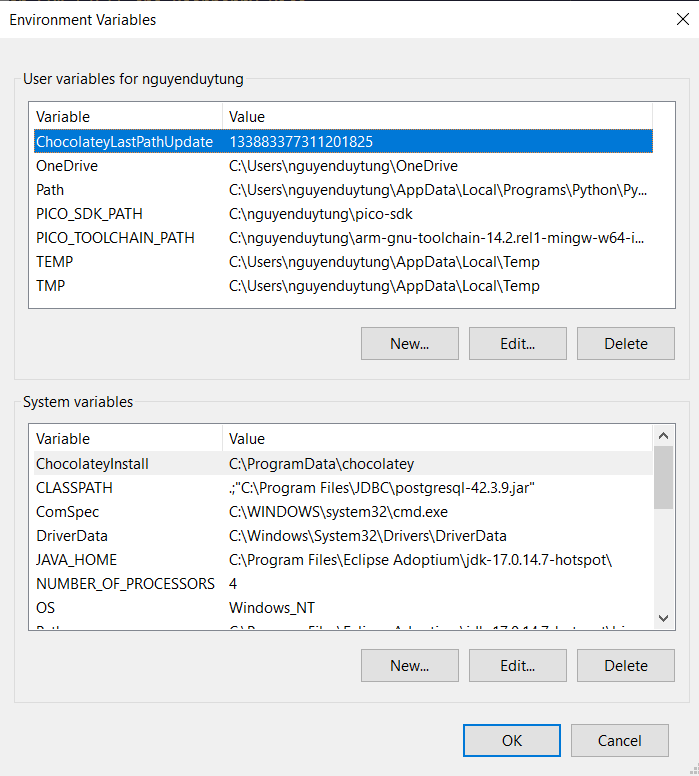

> Lưu ý

File build.py là file tôi viết sãn để bạn tạo project cho pico nên chỉ cần tạo folder r copy file build.pyy build file đó là tự động nó sẽ nạp code 

> Để pico vào boot thì có 2 loại board 

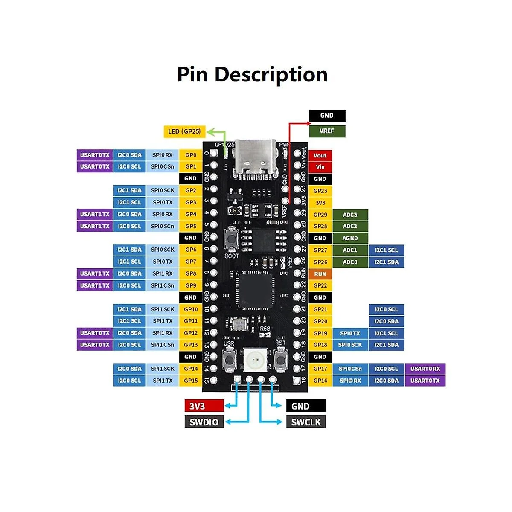

Board như này nghĩa có 1 button BOOT và 1 button RESET để vào chế độ BOOT ta cấp nguồn USB trước rồi ấn giữ RESET sau đó ấn BOOT xong nhả RESET nhả BOOT sẽ vào bootloader

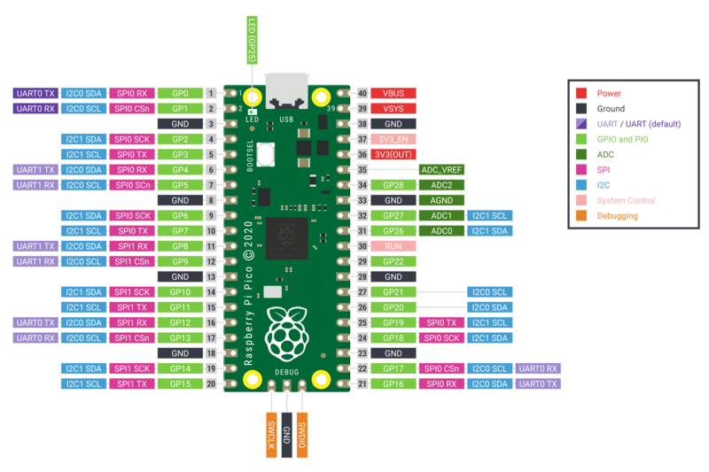

Board như này nghãi là chỉ có 1 button BOOT thui nên đầu tiên rút nguồn USB sau đó ấn dữ BOOT rồi cấp nguồn USB nhả BOOT thì sẽ vào chế độ bootloader