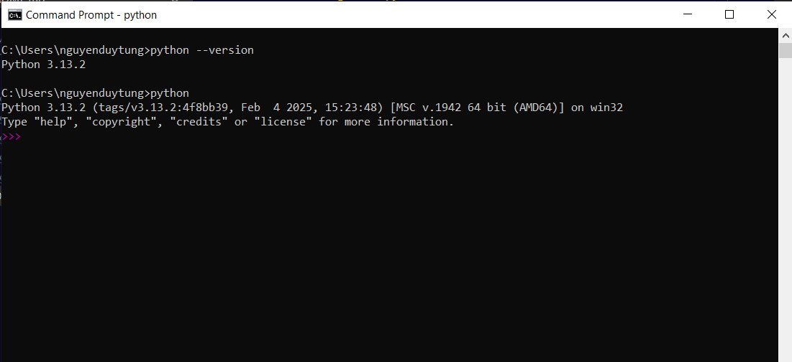

# Hướng dẫn tạo môi trường lập trình cho các dòng vi điều kiển

> Tiêu biểu sẽ là ESP32 và RASPBERRY PICO

## Môi trường Micropython

- Lập trình được ESP8266, ESP32 và RASPBERRY PICO

Bước 1: Di tới trang của hãng Micropython để tải firmware theo chip sử dụng

[Đường dẫn tới Micropython](https://micropython.org/download/)

Bước 2: Tải firmware cho vi điều khiển cần sử dụng


> Trong ví dụ chọn ESP32 dòng ESP32C3


> Firmware là các file .bin hoặc đuôi khác như .app-bin,...


> Click chọn file mong muốn và tải về máy lưu trữ ở thư mục dễ nhớ dễn tiếp cận

Bước 3: Sử dụng môi trường python 

> Check xem máy tính cá nhân có môi trường python chưa



> Nếu như trong hình là đã có nếu không thì ấn vào đây cài python cho máy tính bạn

[Đường dẫn tới python](https://www.python.org/downloads/)


> Nhớ tích Add python.exe to PATH

> Sau khi có python thì mở terminal

> Tạo môi trường ảo

```bash
python -m venv venv
```


> Kích hoạt môi trường ảo python

```bash
venv\Script\activate
```


- Thư viện để flash vi điều khiển

```bash
pip install esptool
```

- Thư viện để đẩy file python qua vi điều khiển

```bash
pip install adafruit-ampy
```

- Ví dụ:

```bash
ampy -p COMx put main.py
```

- Thư viện để remote vào vi điều khiển

```bash
pip install mpfshell
```

- Ví dụ 

```bash
mpfshell COMx
```

> Chú ý: hiện tại khi cài và chạy mpfshell sẽ bị lỗi


- Cách khắc phục 

```bash
pip install telnetlib3
```


Vào `..\Lib\site-packages\mp\contelnet.py` để sửa 


Nhớ lưu


Như vậy là thành công